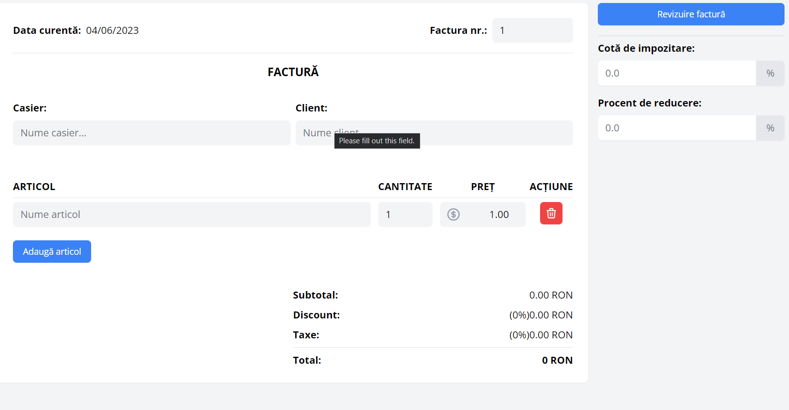
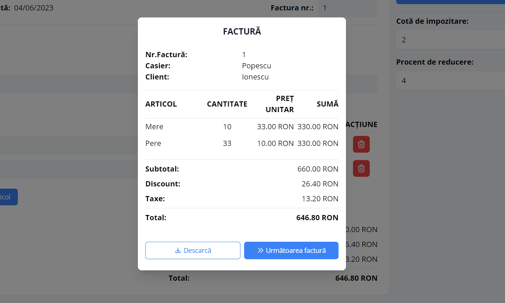

# Invoice Generator - ReactJs


An Invoice Generator project built with React and TailwindCSS. Add items, quantity, prices, tax rates and discounts. Download Generated Invoices as PDFs to your device and print out. Use [html-to-image](https://github.com/bubkoo/html-to-image) to capture the data from modal and convert it from canvas to pdf with [jsPDF](https://github.com/parallax/jsPDF).

### Live Demo

https://react-invoice-generator.web.app/

### Screenshots





### Tools

- React
- Tailwind CSS
- Headless UI
- Html-to-image
- jsPDF

### Instalation

```
git clone https://github.com/MirceaCristurean/invoiceGenerator

npm install

npm start / npm run build
```

### Meta

Mircea Cristurean
